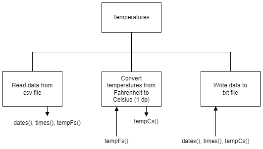

# Instructions

## Overview

There is a year's worth of temperature readings in a [csv file](assets/tempF.csv "data file"): 8,759 readings.  Unfortunately, they are all in Fahrenheit and need to be converted to Celsius, rounded to 1 decimal place.

## Top Level Design (Psuedocode)

1. Read the data from the csv file: `tempF.csv`
2. Convert the temperatures to Celsius
3. Write the data to the text file: `tempC.txt`

## Top Level Design (Structure diagram)




## Data

The supplied data is in the format:

* Date: YYYY-MM-DD
* Time: HH:MM:SS
* Temperature: 1 decimal place

```
2010-01-01,01:00:00,34.5
2010-01-01,02:00:00,34.2
2010-01-01,03:00:00,33.9
...
```
