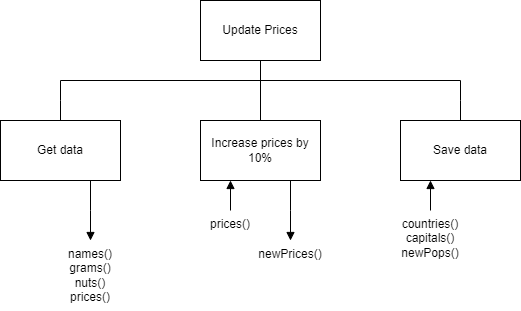

# H SDD - Update Countries

The file [costs.csv](assets/costs.csv "CSV file") contains the information about seven sweets that are sold in a tuck shop.  There are four fields in the file: Name, Weight, Contains nuts, Price.  Increase the price by 10%, and then save the data in a new file called `updated.csv`.

