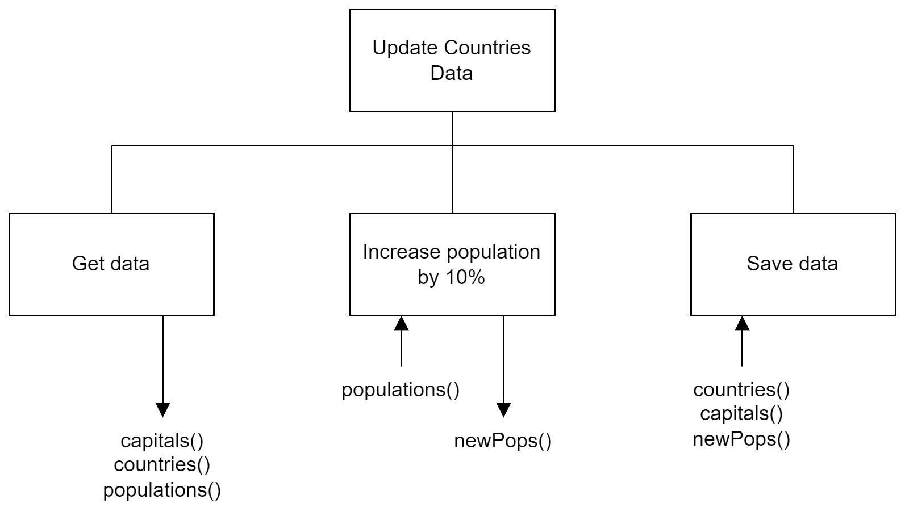

# H SDD - Update Countries

The file [countries.csv](https://github.com/MrFriendCS/MrFriendCS.github.io/blob/main/higher/H-SDD-Update-Countries/countries.csv "CSV file") contains the information about six countries.  Increase the populations by 10%, rounded to 1 decimal place, and then save the data in a new file called `updated.csv`.  Hint, be careful of the order of the parallel arrays.

