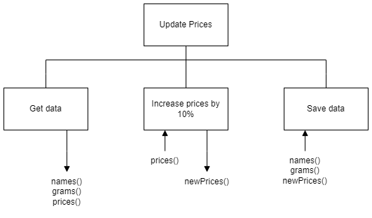

# H SDD - Update Prices

The file [costs.csv](assets/costs.csv "CSV file") contains the information about seven sweets that are sold in a tuck shop.  There are three fields in the file: Name, Weight, and Price.  Increase the prices by 10%, and then save the data in a new file called `updated.csv`.

