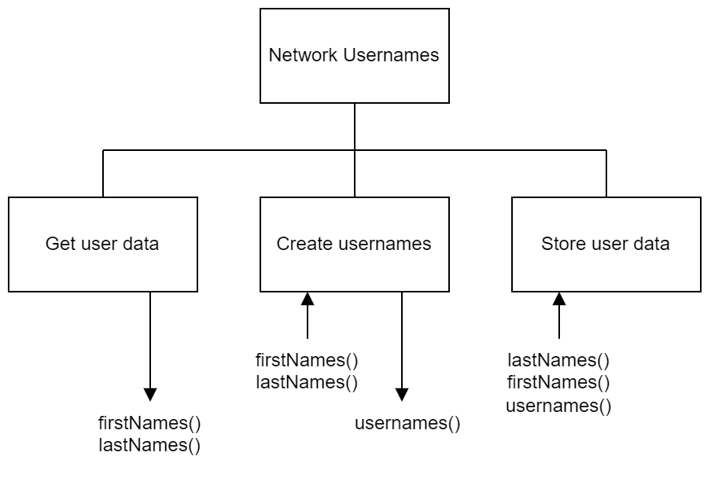
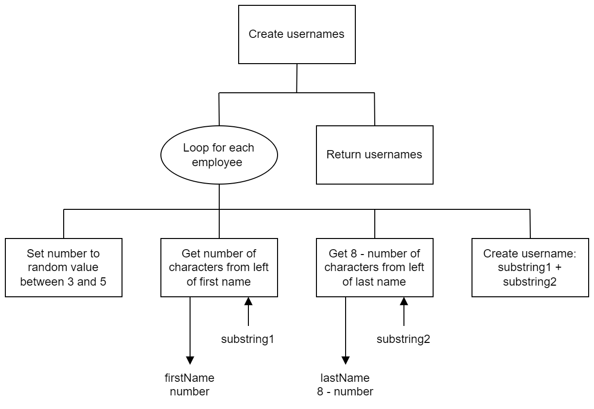

# H SDD - Usernames

## Introduction

New employees at the Barra Computing Centre (BCC) are issued with usernames and passwords so they can log on.

For security purposes, the usernames and initial passwords are created using different systems, and usernames are created in batches of 20.

## Task

Implement the design shown below for creating the usernames.  The names of the employees are stored in `employees.csv`.  The final data is to be stored in `usernames.csv`.

Usernames are always 8 characters long, using a mixture of characters from the first name and last name.  If a first name or lastname is too short to produce the required number of characters then underscores (`_`) will be added.

### Example 1

* First name: Jeremy
* Last name: Castle

Username could be:

* JerCastl (3 + 5)
* JereCast (4 + 4)
* JeremCas (5 + 3)

### Example 2

* First name: Sue
* Last name: MacNeil

Username could be:

* SueMacNe (3 + 5)
* Sue_MacN (4 + 4)
* Sue__Mac (5 + 3)

### Example 3

* First name: Phillipa
* Last name: Low

Username could be:

* PhiLow__ (3 + 5)
* PhilLow_ (4 + 4)
* PhillLow (5 + 3)

## Design

### Refinement

## Assumptions

`employees.csv` is correctly formatted and contains the details of 20 employees.