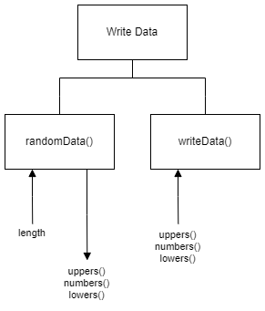

# H SDD - Write Data Part 1

## Introduction

Random data is required to help test some software.  A modular program is required to produce three series of:

1. random uppercase characters (A-Z)
2. random single digits (0-9)
3. random lowercase characters (a-z)

## Task

Implement a program that matches the data flow in the structure digram below.  The data is to be written to `randomData.csv`.

### Design (Structure diagram)

