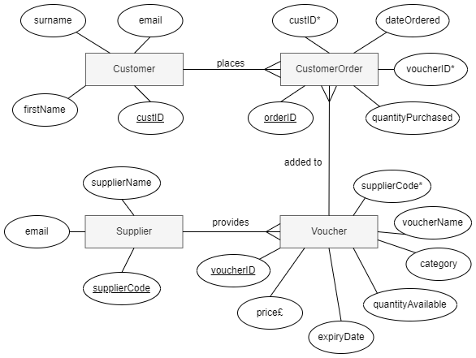

# H CS 2021 Task 2 Part B

### Database design and development

The entity relationship diagram for the MyTreat database is shown below.



___2c___ MyTreat would like to know how much money is being spent on the different types of escape room vouchers.

A query is required to find customers who have purchased vouchers for an escape room from the ‘Adventure’ category. The output should include the amount of money spent by the customer on the voucher.

Implement the SQL statement to produce the following output.

(__3 marks__)

| firstName | surname | voucherID | Amount of Money Spent on Voucher £ |
| --------- | ------- | --------- | ---------------------------------- |
| Neville   | Wilson  | V368      | 32 |
| Bailey    | Donald  | V369      | 80 |
| Aziah     | Moqsud  | V890      | 172 |
| Chukka    | Radebe  | V890      | 86 |
| Becky     | Bennett | V890      | 344 |

___2d___ MyTreat would like to know how many vouchers are still available for voucher ID V543.

Implement the SQL statement(s) to produce the following output.

(__4 marks__)

| voucherID | supplierName | voucherName          | Still Available |
| --------- | ------------ | -----------          | --------------- |
| V543      | SkatePark    | Skate park and lunch | 198 |

For 2c and 2d print evidence of:

* the implemented SQL statement(s)
* the output produced

_Include your name and candidate number on all evidence._

___2e___ A query is designed to find the number of customers who bought a voucher from the ‘Family’ category that costs less than £15.00.

The expected output from the query is shown below.

| supplierName    | voucherName              | price£ | Number of Customers |
| ------------    | -----------              | ------ | ------------------- |
| Cuddle World    | Teady Bears’ Picnic      | 10.00  | 4 |
| WonderPlay      | Trampoline               | 4.00   | 3 |
| WonderPlay      | Softplay and lunch for 2 | 12.00  | 2 |
| Family Fun Club | Softplay and cake        | 6.00   | 1 |

The SQL statement shown below was implemented.

``` SQL
SELECT Supplier.supplierName, Voucher.voucherName, Voucher.price£, Sum(Voucher.price£) AS [Number of Customers]
FROM CustomerOrder, Supplier, Voucher
WHERE CustomerOrder.voucherID=Voucher.voucherID AND Supplier.supplierCode=Voucher.supplierCode AND Voucher.price£<15 AND Voucher.category="Family"
GROUP BY Supplier.supplierName, Voucher.voucherName, Voucher.price£;
```

The query to test the above SQL statement is provided with the database.

Test the SQL statement by running the query.

Amend the query to produce the expected output as shown above.

(__2 marks__)

_Print evidence of the amended SQL statement._

_Include your name and candidate number on all evidence._

___2f___ The `Voucher` table has no validation.

Evaluate one potential problem that may occur when adding new data to this table.

(__1 mark__)
