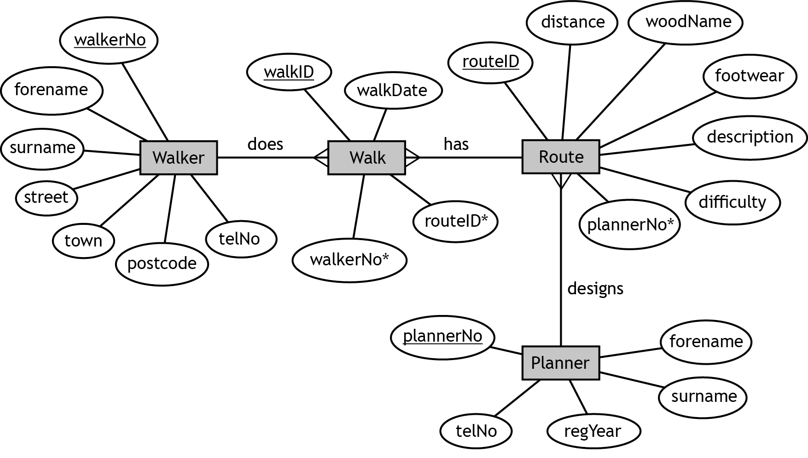

# H CS 2021 Task 2 Part B

The entity-occurrence diagram is used to draw the entity-relationship diagram for the Walkers database shown below.



The design is then implemented.

___2b___ West Fife Walkers wants the most successful planner to design a new route. The most successful planner is the person whose route(s) have been walked more than other routes.

A query is required to display details of the four planners, along with the total number of times their route(s) have been walked. The most successful planner should be displayed at the top.

Implement the SQL statement to produce the following output.

(__4 marks__)

| forename | surname | plannerNo | Total participants |
| -------- | ------- | --------- | ------------------ |
| Heidi    | Benton  | 101       | 273 |
| Selena   | Booker  | 103       | 260 |
| Daniel   | Little  | 104       | 169 |
| Takeshi  | Chen    | 102       | 103 |

_Print evidence of the implemented SQL statement and the output produced._

_Include your name and candidate number on all evidence._
 
___2c___ The most successful planner begins to design the new route. As this route will be longer than the current longest route, West Fife Walkers would like to produce a list of all walkers who have walked the current longest route to ask them questions.
	
Implement the SQL statement(s) required to produce the list. The expected output is partially shown below.

(__5 marks__)

| walkerNo | forename | surname | telNo |
| -------- | -------- | ------- | ----- |
| 162000   | Nancy    | Burch   | 07820 622714 |
| 165692   | Lola     | Kent    | 07533 447224 |
| 167407   | Lelia    | Mercado | 07740 567706 |
| 167549   | Jayne    | Mcneil  | 07758 443003 |
| 169193   | Ofelia   | Nash    | 07796 861247 |
| 191025   | Trina    | Hinton  | 07677 367751 |
| 192174   | Lorena   | Boyle   | 07142 881757 |
| …        | …        | …       | … |

_Print evidence of the implemented SQL statement(s) and the output produced._

_Include your name and candidate number on all evidence._

___2d___ The footwear field in the Route table contains suitable footwear for the routes:

* Trail shoes
* Walking boots
* Waterproof shoes
* Boots (high ankle)
* Boots (robust, waterproof)
* Walking shoes

A query is designed to find all the routes that are suitable for any type of shoe.

The SQL statement shown below was implemented and tested.

```SQL
SELECT Route.routeID, woodName, description
FROM Route
WHERE footwear = "Trail shoes"
OR footwear = "Waterproof shoes"
OR footwear = "Walking shoes";
```

The actual output from this SQL statement matches the expected output and is shown below.

| routeID | woodName  | Description |
| ------- | --------  | ----------- |
| Dea002  | Dean Wood | The forestry road is an easy stroll with open views of the surrounding area and its wildlife. The other half of the walk takes you through woodland down into the valley. |
| Dev002  | Devilla   | This walk completes the circuit round the end of the squirrel walk passing seats and nice picnic areas. On the way back a connecting path is taken to join one of the forestry roads. |
| Bal001  | Balgownie | The Balgownie side of the walk is a mixture of open forestry road and woodland paths. The eastern edge has a well-established path through a community wood. |

West Fife Walkers will add new routes to the database in the future. These new routes may include additional types of shoes.

Re-write the query so that it will always produce the expected output even if additional types of shoes are added.

Test that your amended query still produces the above output.

(__2 marks__)

_Print evidence of the amended SQL statement and the output produced._

_Include your name and candidate number on all evidence._

___2e___ Initial analysis identified the following functional requirements:

* display suitable footwear for a chosen route
* display walkers who prefer to walk a route with a chosen level of difficulty
* display a list of walkers who have walked the longest route
* find the travelling distance from a walker’s home to the starting point of a chosen route
* count number of route planners registered in a given year
* display the total number of walkers who have walked a route designed by each route planner 

State the functional requirement that cannot be implemented using the West Fife Walker’s database.

(__1 mark__)
