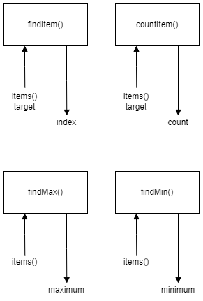

# H SDD – Algorithm

## Introduction

Higher CS has four standard algorithms:

1. Linear search
2. Count occurrences
3. Find maximum
4. Find minimum

## Task

Using the design below, create a function for each of the standard algorithms.

The linear search is to return a value of `-1` if the target is not found.

Save the code as `algorithm.py`.

### Top level design

## Testing

Run the file [Algorithm-Test.py](assets/Algorithm-Test.py "Download file"). The file must be in the same folder as `algorithm.py`.
