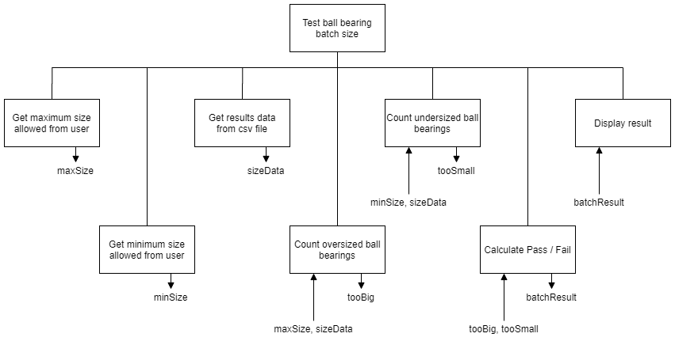

# H SDD - Ball Bearings v1

Barra Ball Bearings Ltd produce top quality ball bearings for high spec engineering projects.  Whilst the products always go through quality assurance there are very few ball bearings that fail to meet the required specification, so it is just done manually.

Unfortunately, there is a blip each year when pupils from the local school undertake a week's work experience.  The number of failures increases and it becomes too time consuming to be done manually.  The company has asked another local company, Sea Software Ltd, to produce a solution to help speed up the process.

Batches of 1,000 ball bearings are electronically measured, and the results of each ball bearing are stored in a csv file.  If too many of the ball bearings are too big or too small the batch is melted down and the batch is remade.

A batch of ball bearings fails when:

    • 5% or more are too big
    • 5% or more are too small
    • 7% or more are too big or too small

The ball bearing specification is 3 cm ± 0.01 cm.

As an employee of Sea Software Ltd you are to produce the software solution, in Python, using the design below.  In line with company policy, you will need to use meaningful identifiers, internal commentary, whitespace, and indentation.  The code must be modular to aid maintainability, plus there is another project being planned that will build on this code.

Evaluate the solution.  Does it meet the requirement?  Is it robust?  Could it be improved?

## Top Level Design

<table>
<tr>
    <td
<td>1 Get maximum size allowed</td>
<td>OUT: maxSize</td>
</tr>
<tr>
<td>2 Get minimum size allowed</td>
<td>OUT: minSize</td>
</tr>
<tr>
<td>3 Read results data from a file and add to an array</td>
<td>OUT: sizeData()</td>
</tr>
<tr>
<td>4 Count how many ball bearings are too big</td>
<td>IN: maxSize, sizeData() 
    OUT: tooBig</td>
</tr>
<tr>
<td>5 Count how many ball bearings are too small</td>
<td>IN: minSize, sizeData() 
    OUT: tooSmall</td>
</tr>
<tr>
<td>6 Calculate if the batch passes or fails</td>
<td>IN: tooBig, tooSmall 
    OUT: batchResult</td>
</tr>
<tr>
<td>7. Display the result.</td>
<td>IN: batchResult</td>
</tr>
</table>

## Structure Diagram

