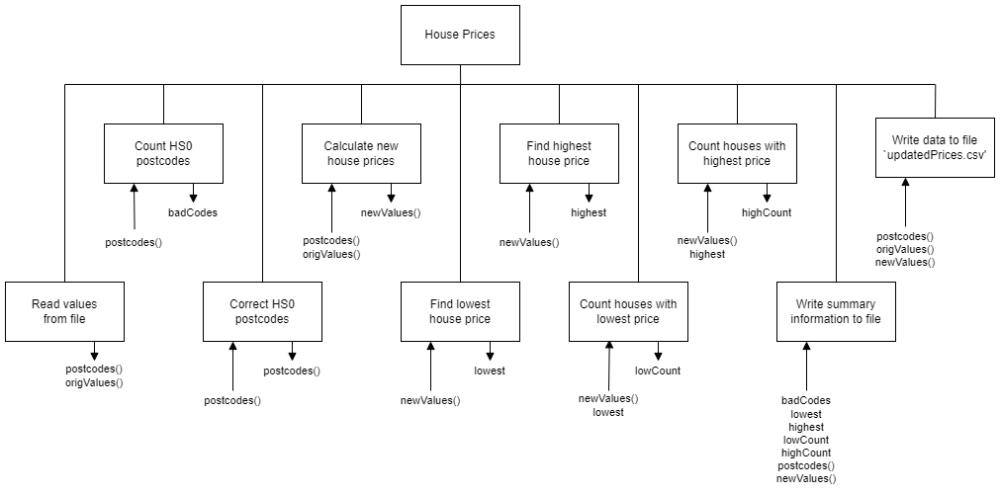

# H SDD - House Prices


## Introduction

Kisimul Conveyancing Ltd (KCL) keeps a database of properties in the Western Isles.

KCL has noticed that the value of properties is generally increasing.  However, not all properties have seen the same increases, in fact some have lost value, it depends of the desirability of the location.

KCL wants to update the property values in its database, and extract some other information.  It will provide a file that only includes the postcodes and current values.

When KCL created the data file ([housePrices.csv](assets/housePrices.csv "Download file")) a small error changed some of the postcodes from HS1 to HS0.


## Analysis

### Postcode Format

Each property has a postcode in the format:

 * HSx #ab

Where:

 * __x__ is a single digit
 * __#__ is a single digit
 * __a__ is a single letter
 * __b__ is a single letter


## Design

 1. Get the postcodes and current house prices from `housePrices.csv`
 2. Count HS0 postcodes
 3. Correct HS0 postcodes
 4. Calculate the new house prices, using the postcode, to the nearest pound
 5. Find lowest house price
 6. Find highest house price
 7. Count number of properties with lowest house price
 8. Count number of properties with highest house price
 9. Create a summary file `summary.txt`
10. Create a data file `updatedPrices.csv`


### Refinements

```
4.1 HS1 to HS5: decrease by 2%
4.2 HS6 to HS8: increase by 2%
4.3 HS9: increase by 5%
```


### Structure diagram




## Example Output

### summary.txt

```
Summary
-------

HS0 errors: 6

Lowest:  £25000
Highest: £250000

Lowest postcodes: 3
  HS1 2AB
  HS3 4CD
  HS5 6EF
  
Highest postcodes: 2
  HS7 6XW
  HS9 8ZY
```

### updatedPrices.csv

```
HS1 1AA,100000,98000
HS6 2BB,100000,102000
HS9 3CC,100000,105000
...
```


## Assumptions

1. There are 1000 properties.
2. The data is correctly formatted in the file provided by KCL.
