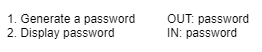
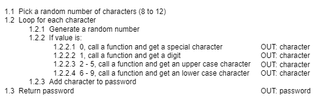
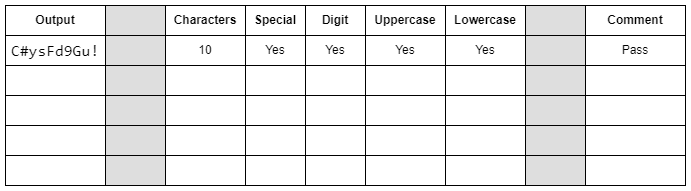
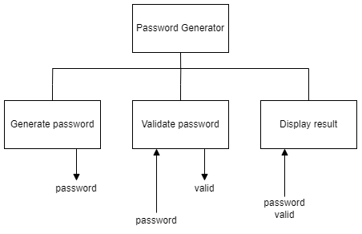

## H SDD - Password Generator

A password generator is required to create a password that:

* is 8 to 12 characters long
	
* each character has the following probabilities:
	
    * 10% - a special character: ! " # $ % & ' ( ) *
	* 10% - a digit: 0 - 9
	* 40%  - an uppercase letter: A - Z
	* 40%  - a lowercase letter: a - z

A valid password will include at least one of each type of character.

## Program top-level design (pseudocode)

### Structure diagram

### Refinements

#### Notes

Functions and procedures can call other functions and procedures.  See 1.2.2.1 to 1.2.2.4 above.

ASCII values are:

* Special: 33 - 42
* Digit: 48 - 57
* Uppercase: 65 - 90
* Lowercase: 97 - 122

### ## User Experience (Example)

`The password is C#ysFd9Gu!`

### Testing

A suggested test table to record the output to see if it meets the requirements is shown below.

## Extension

Modify the code so that testing of the password is automated, and then display the password and whether it is valid, or not.

## User Experience (Example)

`The password YhHDJMbMCAz3 is invalid.`