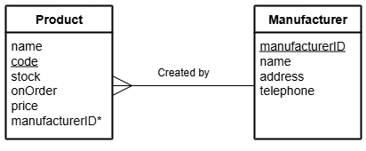

# N5 DDD Delete Queries Part 2

File: [Clydeview.db](../N5-DDD-Clydeview/assets/Clydeview.db "Download file")

## Database

### Table: Product

| Field          | Key  | Type    | Size | Req’d | Validation |
| -----          | :--: | ----    | :--: | :---: | ---------- |
| name           |      | Text    | 30   |       | |
| code           | PK   | Text    | 4    | Y     | |
| stock          |      | Number  |      | Y     | Range: >= 0 and <= 50 |
| onOrder        |      | Boolean |      |       | |
| price          |      | Number  |      | Y     | Range: > 1.00 |
| manufacturerID | FK   | Number  |      | Y     | manufacturerID exists in Manufacturer table |

### Table: Manufacturer

| Field          | Key  | Type    | Size | Req’d | Validation |
| -----          | :--: | ----    | :--: | :---: | ---------- |
| manufacturerID | PK   | Number  |      | Y     | |
| name           |      | Text    | 30   |       | |
| address        |      | Text    | 50   |       | |
| telephone      |      | Text    | 13   |       | |

### Entity Relationship Diagram (ERD)

## Tasks

Using SQL queries:

1. Remove the saw with Product Code SW22 form the database.

2. Remove all products manufactured by the manufacturer with ID 441 from the database.

3. Remove the details of the manufacturer called Craft Supplies from the database.
