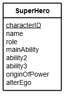

# N5 DDD Query Implementation (Complex)

File: [Clydeview.db](../N5-DDD-Clydeview/assets/Clydeview.db "Download file")

## Entity Relationship Diagram (ERD)

The table called `SuperHero` is shown below.

## Tasks

1.  Search the database to find a character who played the role of `Super Hero` with `Acrobatics` as their main ability.
Display the character’s name, role and main ability.
2.  Search the database to find a character who played the role of `Henchman` whose main ability is `Strength`.
Display the character’s name, role and main ability.
3.  Search the database to find a character who played the role of `Super Villain` whose main ability is `Magic` and whose origin of power is `Training`.
Display the character’s name, role, main ability and origin of power.
4.  Search the database to find a character who played the role of `Super Hero` with the main ability `Magic` whose origin of power is `Training`.
Display the character’s name, role, main ability and origin of power.
5.  Search the database to find a character who played the role of `Super Villain` whose origin of power is `Chemicals` and who has `Gadgets` as ability 2.
Display the character’s name, role, ability 2 and origin of power.
6.  Search the database to find a character who played the role of `Team member` and has the main ability `Water breathing`.
Display the character’s name, role and main ability.
7.  Search the database to find a character who played the role of `Super Hero` who has the main ability `Flight`, ability 2 `Super-strength` and origin of power `Technology`.
Display the character’s name, role, main ability, ability2 and origin of power.
8.  Search the database to find a character who played the role of `Super Villain` with the main ability `Intelligence` and ability 2 `Martial arts`.
Display the character’s name, role, main ability and ability 2.

