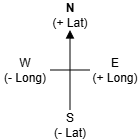

# N5 DDD Fuel Price

File: [FuelPrices.db](assets/FuelPrices.db "Download file")

## Data dictionary

### Table: Station

| Attribute   | Key   | Type    | Size  | Req'd | Validation |
| ---------   | :---: | ----    | :---: | :---: | ---------- |
| id          | PK    | Number  |       | Y     | |
| name        |       | Text    | 30    | Y     | |
| postcode    |       | Text    | 8     | Y     | Length >= 5 |
| motorway    |       | Boolean |       | N     | |
| supermarket |       | Boolean |       | N     | |
| latitude    |       | Number  |       | N     | |
| longitude   |       | Number  |       | N     | |
| e5          |       | Number  |       | N     | |
| e10         |       | Number  |       | N     | |
| b7s         |       | Number  |       | N     | |
| b7p         |       | Number  |       | N     | |
| open        |       | Time    |       | N     | |
| close       |       | Time    |       | N     | |
| openSun     |       | Time    |       | N     | |
| closeSun    |       | Time    |       | N     | |
| carWash     |       | Boolean |       | N     | |
| toilets     |       | Boolean |       | N     | |

# Introduction

In the database there are two types of petrol, Unleaded (E10) and Super Unleaded (E5), and two types of diesel, Standard (B7S) and Premium (B7P).

Each of the stations has it location recorded with latitude (lat) and longitude (long).

## Tasks

1. Display the postcode and name of all locations that have a carwash.
Sort both the postcode and the name alphabetically.

2. Display the name, id and latitude, where the latitude is bigger than `52.0`.
Display the name alphabetically

3. Display the name of the station(s) with postcode `CO10 1GY`.

4. Display the name, id, and the price of Super Unleade of all motorway stations that sell Super Unleaded for more than £1.50.
Names are to be sorted descending.

5. Display the name, postcode, the normal opening and closing times.
Only display stations that are part of a supermarket, and have toilets.
Sort the postcodes alphabetically.

6. Display the name, latitude and longitude of any stations that have toilets but no car wash.
The names of the stations are to be displayed in reverse alphabetical order.

7. The BP station, with the postcode of IP28 6AE, has changed its name to `RL`.

8. A new station has opened called `BARRAFFIN LTD`.
It will have an id of `8000`, and has a postcode of `HS9 5YD`.
This station sells Super Unleaded for £1.23 and Premium Diesel for £1.32.
Add this new station to the database.

9. Delete all stations to the west of A&C MacLean.

10. Display the names and prices of petrol and diesel of stations in postcode `GL7 5DS`.

11. Write a query to display the id, name, postcode, latitude, longitude, and the Sunday opening times.
Only include stations that open after 9&nbsp;am on a Sunday and is not a supermarket, or it closes before 5&nbsp;pm and has a carwash, or does not have toilets and is not on a motorway.
Sort the results with the most northerly latitude first.
