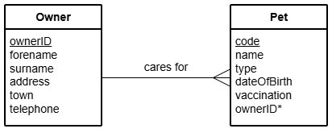

# N5 DDD Insert Queries

File: [Clydeview.db](../N5-DDD-Clydeview/assets/Clydeview.db "Download file")

### Table: Owner

| Field     | Key | Type   | Size | Req’d | Validation |
| -----     | --- | ----   | ---- | ----- | ---------- |
| ownerID   | PK  | Number |      | Y     | |
| firstName |     | Text   | 20   |       | |
| surname   |     | Text   | 30   |       | |
| address   |     | Text   | 50   |       | | 
| town      |     | Text   | 20   |       | |
| telephone |     | Text   | 13   |       | |

### Table: Pet

| Field       | Key | Type    | Size | Req’d | Validation |
| -----       | --- | ----    | ---- | ----- | ---------- |
| code        | PK  | Text    |      | Y     | |
| name        |     | Text    | 20   |       | |
| type        |     | Text    | 8    |       | Restricted choice: Cat, Dog, Budgie, Gerbil, Tortoise |
| dob         |     | Date    |      |       | |
| vaccination |     | Boolean |      |       | |
| ownerID     | FK  | Number  |      | Y     | ownerID exists in Owner table |

### Entity Relationship Diagram (ERD)

## Tasks

Using SQL queries:

1. Add the details of Goldie the dog to the Pet table.

| Field                 | Value |
| -----                 | ----- |
| Pet Code              | P4821 |
| Name                  | Goldie |
| Type                  | Dog |
| Date of Birth         | 2016-10-26 |
| Received vaccination? | True |
| Owner ID              | 3821 |

2. Add the following details of a new owner and their pet to the database.

| Field             | Value |
| -----             | ----- |
| Owner ID          | 3905 |
| First Name        | Gary |
| Surname           | Hughes |
| Address           | 13 Juniper Place |
| Town              | Wemyss Bay |
| Contact Telephone | 07998765432 |

| Field                 | Value |
| -----                 | ----- |
| Pet Code              | P2751 |
| Pet Name              | Usain |
| Pet Type              | Tortoise |
| Date of Birth         | 2006-10-28 |
| Received vaccination? | False |
| Owner ID              | 3905 |

3. Add the following details of a pet and their owner to the database.

| Field                 | Value |
| -----                 | ----- |
| Pet Code              | P0438 |
| Pet Name              | Arnie |
| Pet Type              | Budgie |
| Date of Birth         | 13 March 2017 |
| Received vaccination? | No |

| Field             | Value |
| -----             | ----- |
| Owner ID          | 2664 |
| First Name        | Hannah |
| Surname           | Black |
| Address           | 47 High Road |
| Town              | Greenock |
| Contact Telephone | 01475633633 |
