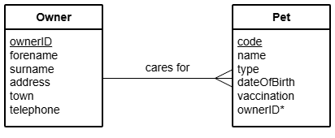

# N5 DDD Update Queries

File: [Clydeview.db](../N5-DDD-Clydeview/assets/Clydeview.db "Download file")

## Database

### Table: Owner

| Field     | Key  | Type   | Size | Req’d | Validation |
| -----     | :--: | ----   | :--: | :---: | ---------- |
| ownerID   | PK   | Number |      | Y     | |
| forename  |      | Text   | 20   |       | |
| surname   |      | Text   | 30   |       | |
| address   |      | Text   | 50   |       | | 
| town      |      | Text   | 20   |       | |
| telephone |      | Text   | 13   |       | |

### Table: Pet

| Field       | Key  | Type    | Size | Req’d | Validation |
| -----       | :--: | ----    | :--: | :---: | ---------- |
| code        | PK   | Text    |      | Y     | |
| name        |      | Text    | 20   |       | |
| type        |      | Text    | 8    |       | Restricted choice: Cat, Dog, Budgie, Gerbil, Tortoise |
| dateOfBirth |      | Date    |      |       | |
| vaccination |      | Boolean |      |       | |
| ownerID     | FK   | Number  |      | Y     | ownerID exists in Owner table |

### Entity Relationship Diagram (ERD)

## Tasks

Using SQL queries:

1. The pet with Pet Code P1559 has just received its vaccination.
Edit the correct record of the database.

2. The owner with Owner ID 2356 has changed her contact number to 07723456789.
Edit the correct record of the database.

3. The owner called Sally Chan has moved house.
Her new address is 64 Lochview Road, Gourock.
Edit the correct record of the database.

4. The date of birth of Gladys the gerbil has been stored incorrectly; it should be 16/10/2004.
Edit the correct record of the database.
