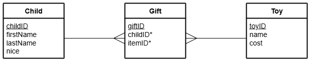

# N5 DDD - Santa Gifts

Database file: [Santa.db](assets/Santa.db "Download file")


## ERD




## Data Dictionary

### Entity: Child

| Attribute | Key   | Type    | Size  | Req'd | Validation |
| --------- | :---: | ----    | :---: | :---: | ---------- |
| childID   | PK    | Number  |       | Y     | |
| firstName |       | Text    | 20    | Y     | |
| lastName  |       | Text    | 30    | Y     | |
| nice      |       | Boolean |       | Y     | |


### Entity: Gift

| Attribute | Key   | Type   | Size  | Req'd | Validation |
| --------- | :---: | ----   | :---: | :---: | ---------- |
| giftID    | PK    | Number |       | Y     | |
| childID   | FK    | Number |       | Y     | Exists in Child table |
| giftID    | FK    | Number |       | Y     | Exists in Toy table |


### Entity: Toy

| Attribute | Key   | Type   | Size  | Req'd | Validation |
| --------- | :---: | ----   | :---: | :---: | ---------- |
| giftID    | PK    | Number |       | Y     | |
| item      |       | Text   | 50    | Y     | |
| cost      |       | Number |       | Y     | |


## Introduction

For as long as anyone can remember, Santa has been keeping lists on paper.  This causes the elves no end of problems when they get nibbled by a reindeer or Mrs Claus has a tidy up and throws out an old scrap of paper that Santa still needs.

The elves have decided to modernise to help keep track of the data that's needed for such a massive operation.  They are starting with a small database, to help Santa with the transition, with just tables of who's been nice, or naughty, and the gifts that Santa will deliver.


## Tasks

1. Display all the data in the `Child` table.

2. Display the full names of all the nice children.  Sort the results alphabetically for both forename and surname.

3. Display all the data in the `Gift` table.

4. Display every field of the `Gift` table if the gift is a `LEGO Technic Lamborghini`.

5. Child 98 has been very nice and will get an extra gift.  Add the following details to the `Gift` table:

```
401,98,"PS5",479.00
```

{:start="6"}
6. Create a query to show just the new record.

7. Child 172 has been very naughty.  Change their `nice` status in the `Child` table.

8. Create a query to show the record has been changed.

9. Child 172 will no longer be getting their original gifts.  Change everything they would have got to a `Lump of coal`, and change the cost to `50p`.

10. Create a query to show all the records that have changed.

11. Display the child ID, forename, and surname of everyone who will receive a `Chad Valley Wooden Pizza` from Santa.  Sort the child ID from largest to smallest.

12. Display the ID and forename of everyone who shares your surname.  Order the names alphbetically.

13. Display the child ID, forename, gift, and gift ID everyone who shares your surname.  Order the names alphbetically.

14. When the elves aren't looking, change your presents in the `Gift` table to something you want, each gift must be different, be sure to change the costs at the same time.

15. Without getting caught, make sure there are at least three presents for yourself in the `Gift` table.  Don't steal somebody else's!

16. Create a query to show all your details from the two tables.  Gifts are sorted from most to least expensive.

17. The elves want a delivery list for Santa.  It is to be sorted alphabetically by surname and then forename.  The elves are insistent that ___only___ nice children are to appear on this list.  Naughty children will be on their own 'special' list.  An example of the output is shown below:

| childId | firstName | lastName   | item |
| ------- | --------  | -------    | ---- |
| 173     | David     | Best       | Marbles |
| 7       | Bianca    | Brotherton | Playdoh |
| 91      | Billy     | Brotherton | Maths set |

{:start="18"}
18. Add an additional filter to the previous query so that it only shows what will be delivered to you.  Another query might be required to make this work as you expect!  If it is, include that SQL as well.
