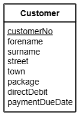

# N5 Select Queries (Simple)

File: [Clydeview.db](../N5-DDD-Clydeview/assets/Clydeview.db "Download file")

## Table: Customer

## Tasks

Using SQL queries:

1. Search the database to display the full name (`forename` and `surname`) of the customer 
with the surname _Rice_.
2. Search the database to display the full name and `town` of all customers who live in _Inverkip_.
3. Search the database to display the `surname`, `package` and `town` of all the customers 
who are on the _Large_ package.
4. Search the database to display the `surname`, `town` and `street` of all the customers 
who live in _Port Glasgow_.
5. Display the `forename`, `surname` and `town` of all of the customers and sort these details 
into alphabetical order of `surname`.
6. Display the `forename`, `surname` and `paymentDueDate` of all the customers 
and sort these details into descending order of `paymentDueDate`.
7. Display the `forename`, `surname` and `customerNo` of all the customers with a `customerNo` 
greater than _110_.  Sort the details into alphabetical order of `forename`.
8. Search the database to display the full name and `town` of all the customers who live in 
_Kilmacolm_.  Sort the details into alphabetical order of `surname` and then by `forename`.
