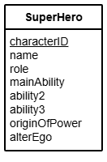

# N5 DDD Select Queries (Complex)

File: [Clydeview.db](../N5-DDD-Clydeview/assets/Clydeview.db "Download file")

## Table: SuperHero

## Tasks

Using SQL queries:

1. Search the database to find a character who played the role of _Super Hero_ with _Acrobatics_ as his/her main ability.
Display the character’s name, role and main ability.
2. Search the database to find a character who played the role of _Henchman_ whose main ability is _Strength_.
Display the character’s name, role and main ability.
3. Search the database to find a character who played the role of _Super Villain_ whose main ability is _Magic_ and whose origin of power is _Training_.
Display the character’s name, role, main ability and origin of power.
4. Search the database to find a character who played the role of _Super Hero_ with the main ability _Magic_ whose origin of power is _Training_.
Display the character’s name, role, main ability and origin of power.
5. Search the database to find a character who played the role of _Super Villain_ whose origin of power is _Chemicals_ and who has _Gadgets_ as ability 2.
Display the character’s name, role, ability 2 and origin of power.
6. Search the database to find a character who played the role of _Team member_ and has the main ability _Water breathing_.
Display the character’s name, role and main ability.
7. Search the database to find a character who played the role of _Super Hero_ who has the main ability _Flight_, ability 2 _Super-strength_ and origin of power _Technology_.
Display the character’s name, role, main ability, ability 2 and origin of power.
8. Search the database to find a character who played the role of _Super Villain_ with the main ability _Intelligence_ and ability 2 _Martial arts_.
Display the character’s name, role, main ability and ability 2.
