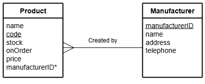

# N5 DDD Select Queries (Equi-join 2)

File: [Clydeview.db](../N5-DDD-Clydeview/assets/Clydeview.db "Download file")

## Introduction

A hardware store uses a relational database to store details of the products for sale and the manufacturer of each product in two separate tables called `Product` and `Manufacturer`.
The structure of the tables is shown below.

### Entity Relationship Diagram (ERD)

## Tasks

Using SQL queries:

1. List the product name, cost price and manufacturer name of all products manufactured by Craft Supplies.

2. List the manufacturer name, address, telephone number and cost price of any manufacturer who supplies products that cost more than £100.

3. List the name of any manufacturers with the product names and cost price of any products that are on order.

4. List the product name and manufacturer name of any products with 12 or more in stock.

5. List the product names, prices and manufacturer name of all products manufactured by Tool Makers.
These details should be displayed in increasing order of price.

6. Display the manufacturer name, address, on order details and number in stock information for products that are not on order.
These details should be arranged in decreasing order of number in stock.

7. Display the product name, number in stock, cost price and manufacturer name of all products that cost less than £20.
These details should be arranged in alphabetical order of manufacturer name; products from the same manufacturer should be displayed in alphabetical order of product name.

8. Display the manufacturer details (name, address and telephone number) together with the product code and number in stock all products that have more than 2 in stock.
These details should be displayed in alphabetical order of manufacturer; products from the same manufacturer should be displayed with the largest quantity in stock at the top.
