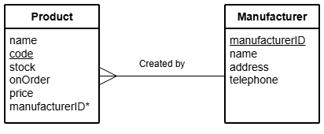

# N5 DDD Update Queries Part 2

File: [Clydeview.db](../N5-DDD-Clydeview/assets/Clydeview.db "Download file")

## Database

### Table: Product

| Field          | Key  | Type    | Size | Req’d | Validation |
| -----          | :--: | ----    | :--: | :---: | ---------- |
| name           |      | Text    | 30   |       | |
| code           | PK   | Text    | 4    | Y     | |
| stock          |      | Number  |      | Y     | Range: >= 0 and <= 50 |
| onOrder        |      | Boolean |      |       | |
| price          |      | Number  |      | Y     | Range: > 1.00 |
| manufacturerID | FK   | Number  |      | Y     | manufacturerID exists in Manufacturer table |

### Table: Manufacturer

| Field          | Key  | Type    | Size | Req’d | Validation |
| -----          | :--: | ----    | :--: | :---: | ---------- |
| manufacturerID | PK   | Number  |      | Y     | |
| name           |      | Text    | 30   |       | |
| address        |      | Text    | 50   |       | |
| telephone      |      | Text    | 13   |       | |

### Entity Relationship Diagram (ERD)

## Tasks

Using SQL queries:

1. The stock level of the product with Product Code MA16 has fallen to 1 and the product is now on order.
Edit the correct record of the database.

2. The manufacturer called Tool Makers has moved.
Its new address is: Unit 6, Avon Industrial Estate, Bath and its new phone number is: 01789334456.
Edit the correct record of the database.
