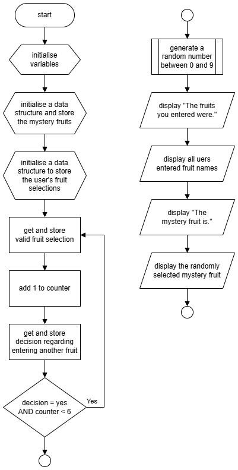
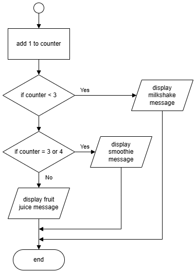
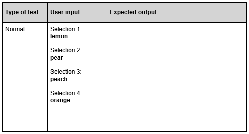

# N5 CS 2024 - Task 1 Part B

## Introduction

Shake-Shake creates fruit-based drinks.
They need a computer program that will tell their customers if selected fruits would make a better milkshake, smoothie or fruit juice.  

## Program description

Shake-Shake wants a computer program that allows users to enter the names of up to 6 fruits.

The user enters the name of each fruit they want in their drink.
The program will validate each fruit name by checking it is at least 4 characters long.

The program then adds a mystery fruit, which it randomly selects from these options:

- apple
- banana
- blueberry
- kiwi
- mango
- orange
- peach
- pineapple
- raspberry
- strawberry

Once the user enters all their fruit options, the program adds the mystery fruit and uses the total number of fruits to determine whether it recommends a milkshake, smoothie or fruit juice.

Shake-Shake recommends that less than 3 fruits should be a milkshake, 3 or 4 fruits should be a smoothie, and more than 4 fruits should be a fruit juice.

The program will output a summary of the user’s fruit choice, including the mystery fruit, and a message advising what type of drink to make.

## Program design (Flowchart)

__1c__ Using the program design, complete the expected output in the test table below. Use mango as the mystery fruit.   (___2 marks___)

__1d__ Using the program description and the design, implement the program in a language of your choice. 

Make sure the program matches the design given.

Run your completed program entering two fruits of your choice.

Print evidence of your program code and your program output.  (___15 marks___)

__1e__ With reference to your code, evaluate your program by commenting on the following:

- Efficient use of programming constructs  (___1 mark___)
- Robustness of your program   (___1 mark___)
- Readability of your code   (___1 mark___)
