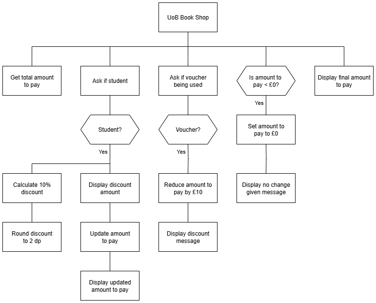

# N5 SDD - Book Shop


## Introduction

The University of Barra (UoB) bookshop wants to update how it calculates the 10% discount that students get when they buy something.  A £10 gift voucher can be used to pay for all or some of the purchase, but only one gift voucher can be used per purchase.  When using a voucher, no change is given if the amount to pay is less than £10.

Currently, the total is rung up using an old till with any discount or vouchers being calculated by hand, and there have been some embarrassing mistakes!  


## Task

Create a program that will accept a non-discounted amount, calculate the discounted price if appropriate, ask for a voucher, and calculate the final price.

A structure diagram of the design is provided below.


### Top Level Design (Structure diagram)




## Assumptions

- The initial amount will be entered as pounds:

    - £10 as 10
    - 50p as 0.50

- Any text entered is lower case.


## Examples

Examples of the expected user interface are shown below with some possible input and output values.


### User Interface - Example 1

```
UoB Book Shop
-------------

Total amount: £10

Student? yes

Discount: £1.0
Amount to pay: £9.0

Voucher? yes
£10 voucher applied
No change given when using a voucher

Final amount to pay: £0.0
====================
```


### User Interface - Example 2
```
UoB Book Shop
-------------

Total amount: £7.25

Student? no

Voucher? no

Final amount to pay: £7.25
====================
```


### User Interface - Example 3
```
UoB Book Shop
-------------

Total amount: £25.50

Student? yes

Discount: £2.55
Amount to pay: £22.95

Voucher? yes
£10 voucher applied

Final amount to pay: £12.95
====================
```
