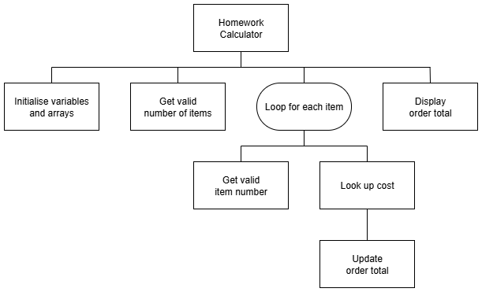

# N5 SDD - Cafe Tangasdale


## Introduction

Cafe Tangasdale is a new business that will provide refreshments to visitors of Halaman Bay.
It hopes to keep costs, and mistakes, to a minimum by using technology.


### Menu

The menu will be kept simple to being with:

| Item    | Cost |
| ----    | ---: |
| Tea     | £1.50 |
| Coffee  | £1.75 |
| Can     | £1.00 |
| Toastie | £2.50 |
| Cake    | £2.25 |


## Task

Implement a solution that matches the design shown below.
A maximum of six of each item can be ordered at a time, more would be unsafe for the staff to carry.


### Top Level Design (Stucture diagram)




## User Interface

An example of the expected user interface is shown below, with some possible input and output values.

```
Cafe Tangasdale
---------------

How many different items: 3

Enter a number for each item:
 1 = Tea, 2 = Coffee, 3 = Can
 4 = Toastie, 5 = cake

First item: 2
How many: 2

Second item: 2
How many: 1

Third item: 4
How many: 3

Order total: £12.75

Only Bitcoin accepted
=====================
```
