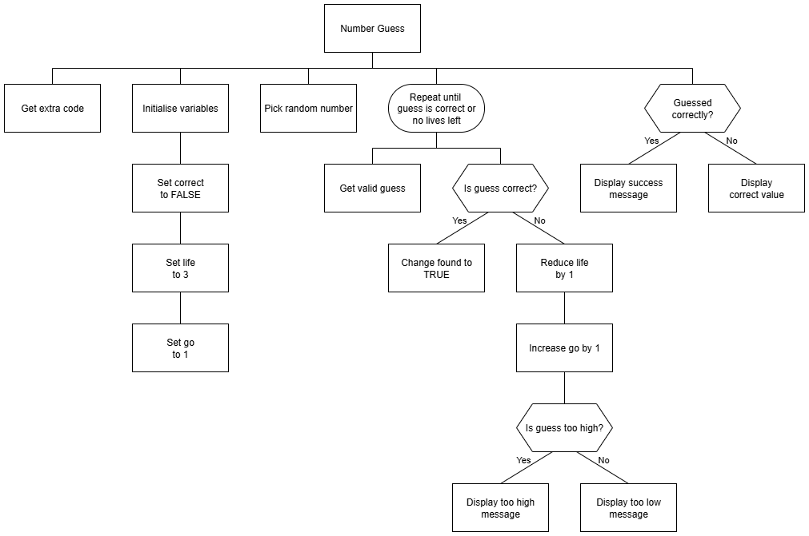

# N5 SDD - Number Guess

## Introduction

A player has a maximum of three chances to guess the random number (1-10) that the computer has picked.


## Task

Implement a solution that matches the design shown below.


### Top Level Design (Stucture diagram)




### User Interface

An example of the user interface is shown below.

```
Number Guess
------------

I've picked a number between 1 and 10.

What is your first guess? 8
Too high!

What is your second guess? 2
Too low!

What is your last guess? 4
Too high!

The correct value was 3.
```
