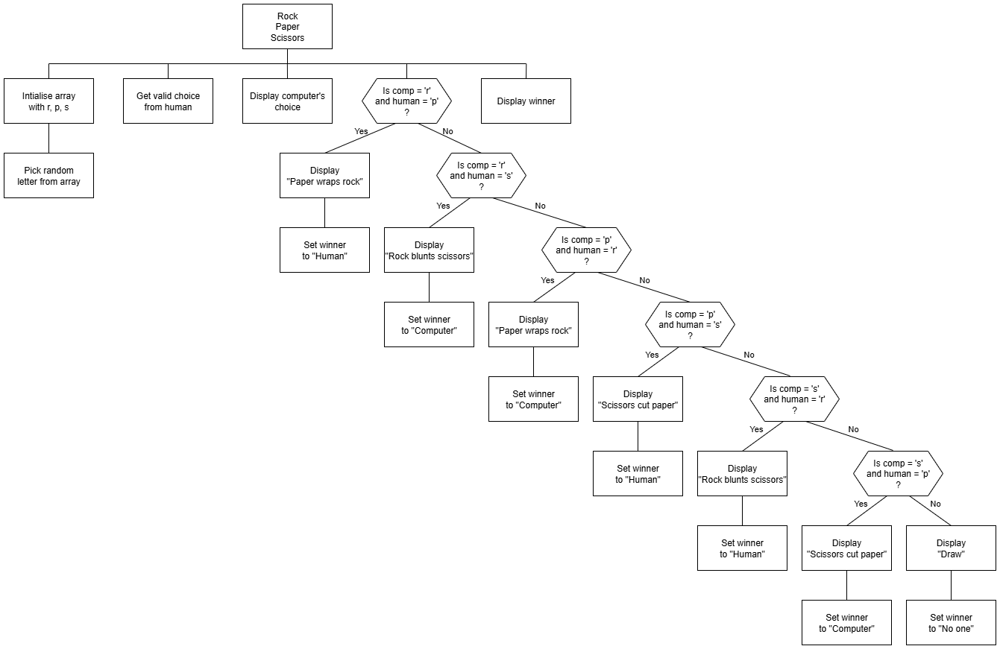

# N5 SDD - Chance Part 7


## Introduction

Playing against the computer, a player chooses either Rock (`r`), Paper (`p`), or Scissors (`s`).


## Task

Implement a solution that matches the design shown below.


### Top Level Design (Stucture diagram)




## User Interface

Examples of the expected user interface are shown below, with some possible input and output values.


### Example 1

```
Rock Paper Scissors
-------------------

Choose: r, p, or s

Human: s
Computer: p

Scissors cut paper!

Winner: Human
===================
```


### Example 2

```
Rock Paper Scissors
-------------------

Choose: r, p, or s

Human: p
Computer: p

Draw!

Winner: No one
===================
```
