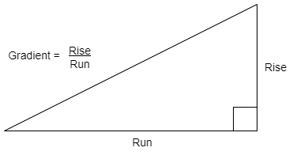

# N5 SDD - Gradient Calculator Part 2


## Task

Calculate the gradient of a slope when the user enters values for the **rise** and the **run**.  Round the result to 2 decimal places.


### Top level design (Structure diagram)


### Calculate gradient




### Example User Interface

``` python
Gradient Calculator
-------------------

                   .
               .   |
           .       |
       .           | Rise
   .               |
___________________|
       Run


What is the rise? 2.5
What is the run? 10

           Rise   2.5
Gradient = ---- = ----
           Run    10.0

Gradient = 0.25
===================
```
