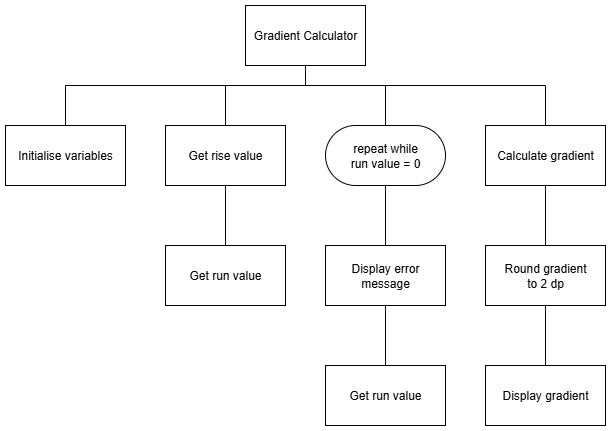
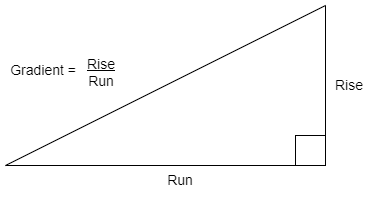

# N5 SDD - Gradient Calculator - Part 4

## Task

Use the structure diagram to implement a program that will calculate the gradient when a user enters the __rise__ and the __run__.

### Top level design (Structure diagram)

#### Calculate gradient

### Assumptions

* The __rise__ and __run__ values can be real values.
