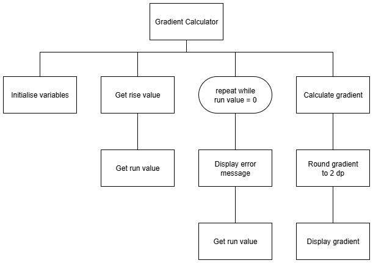

# N5 SDD - Gradient Calculator - Part 4

## Task

Use the structure diagram to implement a program that will calculate the gradient when a user enters the **rise** and the **run**.

### Top level design (Structure diagram)

#### Calculate gradient

### Assumptions

* The **rise** and **run** values can be real values.
