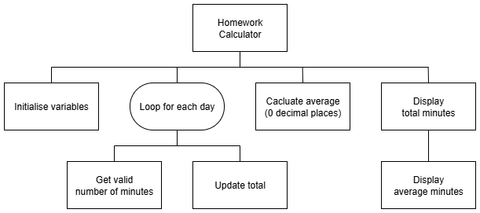

# N5 SDD - Homework Calculator


## Introduction

Homework reinforces and extends the learning that happens in school.  Without keeping a homework record, it's easy to overestimate how much has actually been done.


## Task

Implement a solution that matches the design shown below.


### Top Level Design (Stucture diagram)




## User Interface

An example of the expected user interface is shown below, with some possible input and output values.

```
Homework Calculator
-------------------

How many mintues did you do on:

Monday: 5
Tuesday: 5
Wednesday: 20
Thursday: 15
Friday: 5
Saturday: 10
Sunday: 65

You did a total of 125 minutes last week.

You did an average of 18 minutes a day.

===================
```
