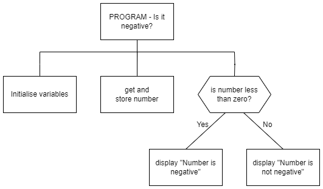

# N5 SDD - Negative  


## Task

Create a program that will determine if a number is negative or not.

Follow the design shown in the structure diagram below.


### Top level design (Structure diagram)




### Example use interface

``` python
Number Checker
--------------

Enter a number: 23.45

Number is not negative

==============
```
