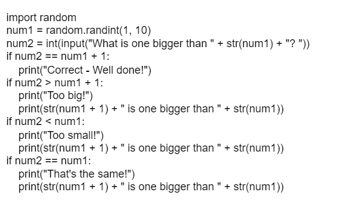

# N5 SDD - Number Game

The local nursery wants to help children practise the concept of plus 1, using the numbers 1 to 10.

## Analysis

The program will pick a random value, 1 to 9, and show it to the child.  The child is then asked what number is one more than the number shown.

The child could provide an answer that is:

* correct
* too big
* too small
* the same

An appropriate message should be displayed, and the correct answer given if incorrect.

### Input

* enter a valid answer

### Process

* pick a random number
* determine how the answer compares with the random number

### Output

* a message is displayed if the answer is correct
* a message, including the correct answer, is displayed if the answer is too big
* a message, including the correct answer, is displayed if the answer is too small
* a message, including the correct answer, is displayed if the answer is the same

### Assumptions

* the answer that a child can give is from 1 to 10 inclusive
* all values are integers

## Design

## Implementation

The design was implemented, as shown below.

## Testing

___1___ Produce screen shots to show each of the four possible messages being correctly displayed.  __(2 marks)__

## Evaluation

___2___ With reference to the implemented code and any testing you have done, evaluate the program by commenting on the following:

* The readability of the code: __(3 marks)__
  
    * Meaningful identifiers
    * Internal commentary
    * Whitespace

* Efficient use of programming constructs in the code. __(1 mark)__

* Robustness of the program __(1 mark)__

* The fitness for purpose of the solution __(2 marks)__

## Iterative Process

___3___ Improve the code to remove any issues that have been identified.

Print evidence of your program code.

___4___ Repeat the testing and evaluation tasks with reference to your improved code.  __(8 marks)__
