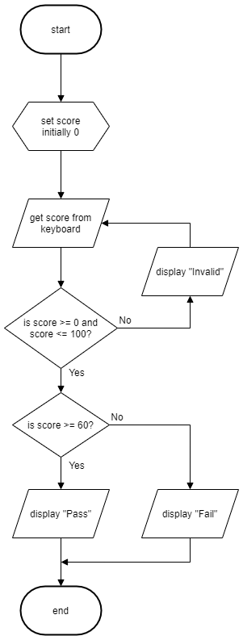

# N5 SDD - Test Result

## Introduction

A user wants an automatic decision system that will classify a test score as either a '__Pass__' or a '__Fail__'.  A score of 60 or more is a pass, and anything else as a fail.


### Top level design (flowchart)




## Tasks

1. Implement a program that matches the design.
2. Ensure the code is efficient.


### Assumptions

All scores are whole numbers.


## User Experience

Examples of the expected user interface are shown below, with possible input and output values.

```Python
Score Classifier
----------------

Enter test score: 75 

Grade: Pass  

================
```


```Python
Score Classifier
----------------

Enter test score: 101

Only score from 0 to 100 are valid.

Enter test score: 11

Grade: Fail  

================
```
