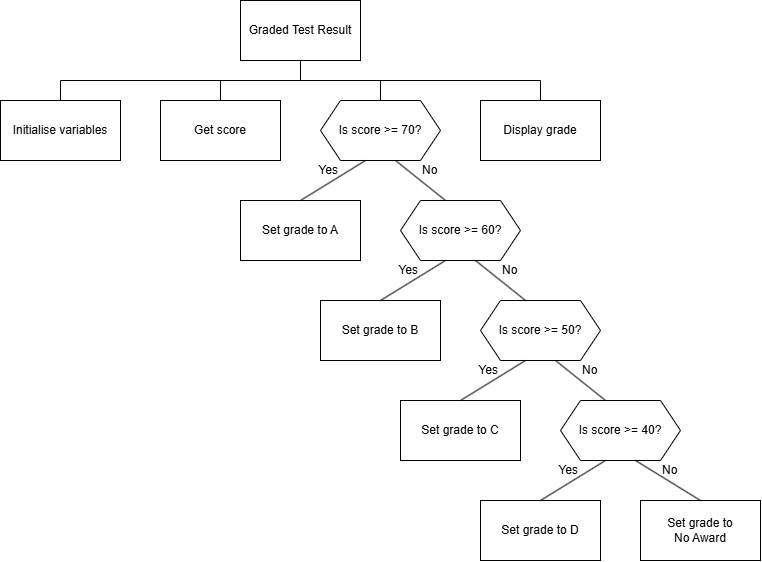

# N5 SDD - Result Part 4


## Introduction

A user wants an automatic grading system that will classify a test score using the table below.

| Mark    | Grade |
| ----    | :---: |
| 70+     | A |
| 60 - 69 | B |
| 50 - 59 | C |
| 40 - 49 | D |
| 0 - 39  | No Award |


## Tasks

1. Implement a program that matches the structure diagram below. Ensure the code is efficient.

2. Use the test plan to check that the program works correctly.

3. Ensure the code is readable by using:

   * Meanigful identifiers
   * Internal commentary
   * Whitespace
   * Indentation


## User Experience

Below is an example of the expected user experience.

```
Test Classifier
---------------

Enter test score: 70  

Grade: A  

===============
```

## Structure Diagram

