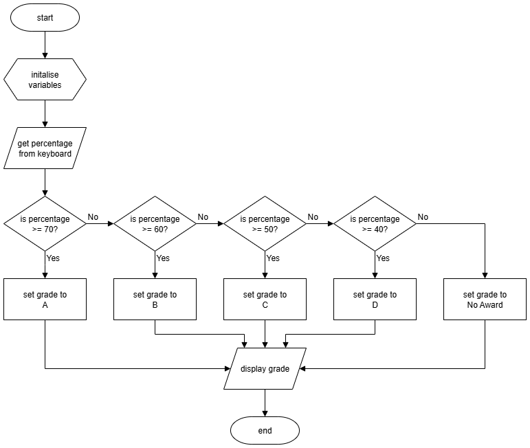

# N5 SDD - SQA Result


## Introduction

SQA National Qualifications (NQs) are graded.  The gerades are determined by the percentage achieved:

| Percentage | Grade |
| :--------: | :---: |
| 70 - 100   | A |
| 60 - 69    | B |
| 50 - 59    | C |
| 40 - 50    | D |
| 0 - 39     | No Award |


## Task

Create a program that will ask for the percentage achieved, and display the grade depending on the percentage.

A flowchart of the design is provided below.


### Top Level Design (Flowchart)




### Assumptions

All scores are whole numbers.


## User Interface

Examples of the expected user interface are shown below with some possible input and output values.


### Example 1

Below is an example of the expected user experience.

```Python
SQA Result Calculator
---------------------

Percentage: 83

Grade: A

=====================
```


### Example 2

Below is an example of the expected user experience.

```Python
SQA Result Calculator
---------------------

Percentage: 38

Grade: No Award

=====================
```
