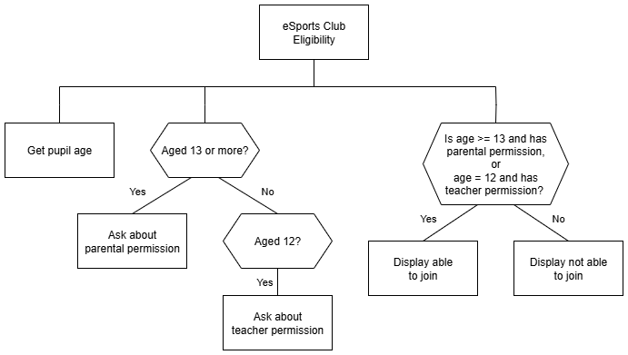

# N5 SDD - School Club


## Introduction

The eSports club is the preimier club within the schoool community.
Only those who meet the strict criteria can join.


### Eligibilty checks

There are two ways to be eligible to join the club:

1. Be aged at least 13, and have parental permission to go.
2. Be aged 12, and have the teacher's permission to go.


## Task

Create a program that will check if someone can join the club.

A structure diagram of the design is provided below.


### Top Level Design (Structure diagram)




## Assumptions

- Any text entered is lower case.


## User Interface

Examples of the expected user interface are shown below with some possible input and output values.


### Example 1

```
Castlebay eSports Club
Eligibility Checker
----------------------

How old are you? 13
Do you have parental permission? yes

You can join the eSports club!

======================
```

### Example 2

```
Castlebay eSports Club
Eligibility Checker
----------------------

How old are you? 12
Do you have teacher permission? yes

You can join the eSports club!

======================
```

### Example 3

```
Castlebay eSports Club
Eligibility Checker
----------------------

How old are you? 12
Do you have teacher permission? no

You can't join the club just now.

======================
```
