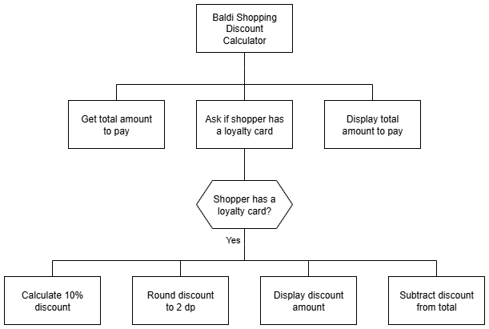

# N5 SDD - Shopping 


## Introduction

Baldi, Barra's answer to Aldi, has many promotions to tempt customers in.
The latest idea is to give a 10% discount to everyone who has a Baldi loyalty card.


## Task

Create a program that ask for the total amount to pay, calculate a discount if appropriate, and display the final price.

A structure diagram of the design is provided below.


### Top level design (Structure diagram)




## Assumptions

1. The amount to pay will be entered as pounds:

* £10 as 10
* 50p as 0.50

2. Any text entered is lower case.


## User Experience

Examples of the expected user interface are shown below with some possible input and output values.


### Example 1
```
Baldi
-----

Total amount: £10

Loyalty card? yes

Discount: £1.0

Amount to pay: £9.0
====================
```


### User Interface - Example 2
```
Baldi
-----

Total amount: £7.25

Loyalty card? no

Amount to pay: £7.25
====================
```
