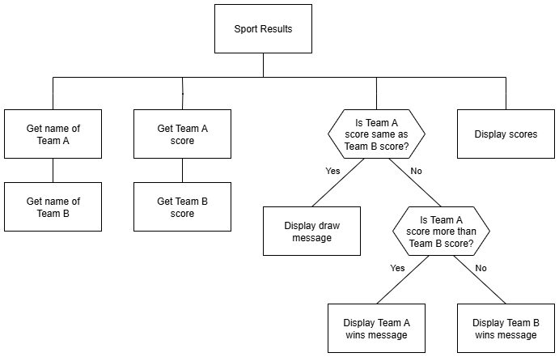

# N5 SDD - Sport Results


## Introduction

The Barra Broadcationg Company (BBC) wants to upgrade how the sport results are produced.
Currently, the results are produced by hand but some of the handwriting is difficult to read which has led to some embarrassing mistakes!


## Task

Create a program that will ask for the names of two sports teams, their respective scores, and display a message depending on the scores.

A structure diagram of the design is provided below.


### Top Level Design (Structure diagram)




## Examples

Examples of the expected user interface are shown below with some possible input and output values.


### User Interface - Example 1

```
BBC Sport Results
-----------------

Team A name: Barra FC
Team A name: Iochdar Saints

Barra FC score: 6
Iochdar Saints score: 2

-----------------

Barra FC wins!

Barra FC 6:2 Iochdar Saints

=================
```


### User Interface - Example 2

```
BBC Sport Results
-----------------

Team A name: Celtic
Team A name: Caley Thistle

Celtic score: 2
Caley Thistle score: 3

-----------------

Caley Thistle wins!

Celtic 2:3 Caley Thistle

=================
```
