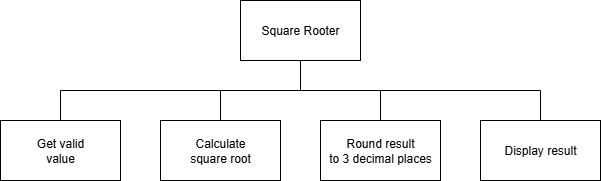

# N5 SDD - Summer Part 1


## Introduction

Create a file called `summer1.py`.


## Task

Write a program to ask the user for a value and then display the square root of the value.
Only values more than zero are acceptable.

__Notes__:

1. Do not import any code
2. Square root of `9` = `3`
3. `9` to the power of `0.5` = `3`


## Design


## Program top-level design (Structure Diagram)




### Example UI

#### Example 1

```
Square Rooter
-------------

Enter a value: 25

The square root is 5.0

=============
```


#### Example 2

```
Square Rooter
-------------

Enter a value: 26

The square root is 5.099

=============
```
