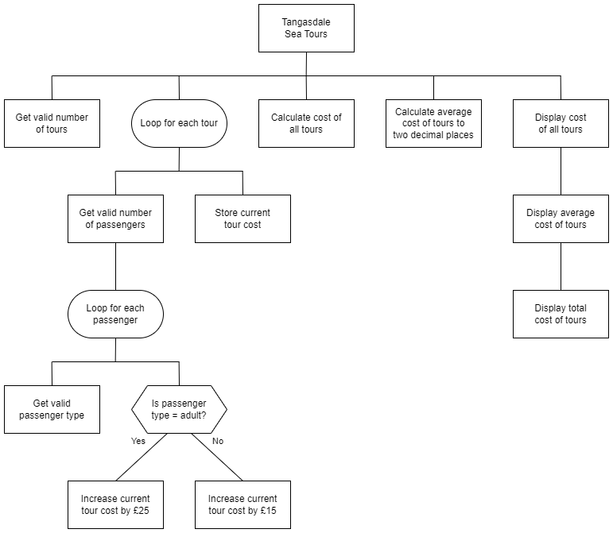

# N5 SDD - TST


## Introduction

Tangasdale Sea Tours (TST) is a small business that does popular tours along the west coast of Barra, with the slogan "__West is Best!__".
Every trip is different, depending on the customers wishes: touring Castlebay marina, visiting the iconic Seal Bay, or going north to see Spàgan.
When the weather is good enough, TST runs up to 4 tours a day, two before lunch and two after lunch.
Each tour has space for 5 passengers, which can be any mixture of adults and children.
An adult ticket is £25 and a child ticket is £15.

At the end of the day the overall takings are calculated from the tickets sold, and an average per tour is caluclated.

## Analysis

### Inputs

* Number of tours
* Number of passengers on each tour
* Passenger type for every passenger


### Processes

* Calculate cost of each tour
* Caculate cost of all tours
* Calculate average cost of a tour (Cost of all tours / Number of tours)
* Round average cost to 2 decimal places


### Outputs

* Cost of each tour
* Average cost of tours
* Total cost of tours

An example of the expected output is shown below.

### Assumption

* Passenger type is a single lowercase character:
    * a = adult
    * c = child


### Design (Structure diagram)




#### Example user interface

```
 TST
-----

Number of tours: 2

Number passengers on tour 1: 2
Tour 1 passenger 1 type: a
Tour 1 passenger 2 type: c

Number passengers on tour 2: 3
Tour 2 passenger 1 type: a
Tour 2 passenger 2 type: c
Tour 2 passenger 3 type: c

Tours
-----

1: £40
2: £55

Avg: £47.5
Total: £95
===========
```


## Task

Using the program analysis and the design, implement the program in a language of your choice.
