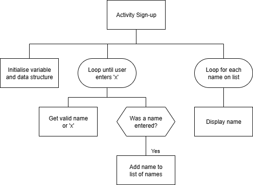

# N5 SDD - Airport Express


## Introduction

The Barra Airport Express bus service has proved very popular, so much so that a new timetable needs to be created.
Nothing has quite been decided but options are being looked at.
An app is needed to help speed up creating the options.


## Task

Create a file called `timetable.py`.

Write a program to ask the user for:

1. The earliest departure time
2. The latest departure time
3. The interval between buses

The program will then display the bus departure times.


## Design


## Program top-level design (Structure Diagram)




### Example User Interface

```
Barra Airport Express
---------------------

Earliest departure time: 0

Latest departure time: 15

Interval between departures: 5

Departure times:

    09:00
    09:05
    09:10
    09:15

====================
```
