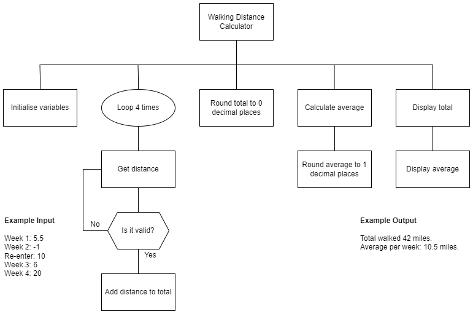

# Instructions  

Using the structure diagram, implement the code and test it.

This task will practise using:

* Input validation
* Running total
* Rounding
* Concatenation

To improve the readability of the program, use:

* Meaningful identifiers
* Internal commentary
* White space
* Indentation

## Structure diagram

  

