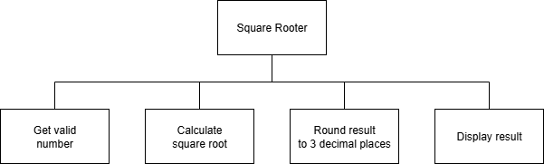

# N5 SDD - Youth Club


## Introduction

Create a file called `activity.py`.


## Task

Write a program to ask the user for the names of people who are signing up for an activity.
Only names with at least three letters are acceptable.


## Design


## Program top-level design (Structure Diagram)




### Example User Interface

```
Activity Registration
---------------------

Enter a name, or 'x' to exit: Beth
Enter a name, or 'x' to exit: Tom
Enter a name, or 'x' to exit: Ivy
Enter a name, or 'x' to exit: x

The following have signed up:

  Beth
  Tom
  Ivy

=====================
```
