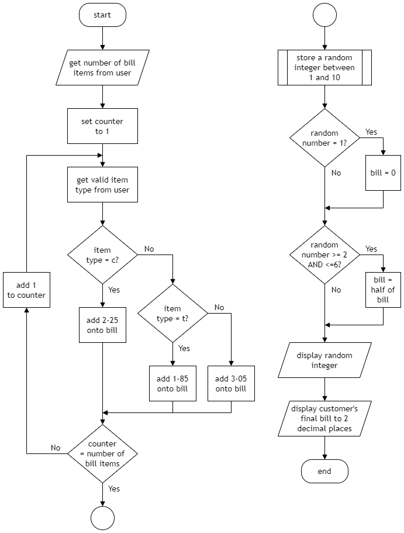
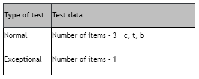

# N5 CS 2020 Task 2B

A new coffee shop is organising an event for its opening day. At this event, a lucky-dip promotion will be available, where customers can win a discount off their bill.

Below is the analysis and design for a program to calculate customers’ bills:

## Program analysis

A program is required to calculate a customer’s bill. The user will enter the number of items on the bill and then enter the item type for each item (coffee, tea or biscuit). The program will calculate the bill. The bill can then be reduced by using a random value from 1 to 10:

* random value = 1	    	the customer pays nothing
* random value = 2 to 6 	the customer pays half the bill
* andom value = 7 to 10 	the customer pays the full bill

### Assumptions

* any number of items can be entered by the user

### Inputs

* the number of items on the bill
* the item type for each item on the bill
    * c = coffee
    * t = tea
    * b = biscuit

### Processes

* generate a random value between 1 and 10
* calculate the total cost of the items on the bill where:
    * coffee = £2.25
    * tea = £1.85
    * biscuit = £3.05
* use the random value to calculate the final bill

### Outputs
* the random value
* the cost of the final bill 

## Program design



___2b___ Using the program analysis and the design, implement the program in a language of your choice.

Ensure the program matches the flowchart provided. (__15 marks__)

Print evidence of your program code.

___2c (i)___ Your program should be tested to ensure it produces one of three different random outputs.

Use the following data to do this:

```
Number of items: 4
Item 1: coffee
Item 2: tea
Item 3: tea
Item 4: biscuit
```

State the possible values (outputs) for the final bill produced from this test data.

Run your program to show that it produces one of these three outputs.

Print evidence of the test run showing inputs and outputs. (__2 marks__)

___2c (ii)___ Complete the test table below to check the validation for the item type.



Run your program to show the result of the exceptional test data. (__1 mark__)

Print evidence of the test run.

___2d___ With reference to your code, evaluate your program by commenting on the following:

* Efficiency of your program code (__2 marks__)
* Robustness of your completed program (__1 mark__)
* Readability of your code (__1 mark__)