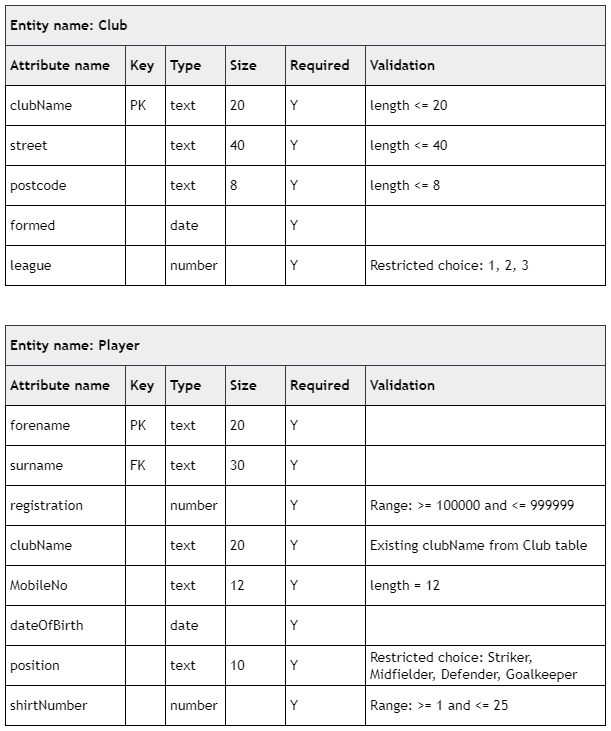

# N5 CS 2021 Task 2C

## Data dictionary



## Tasks

___2d (i)___ Noreen Glass, registration number 814209, has moved teams from Aviemore Aces to Dundee North. She will play in the number 24 shirt at her new club.

Implement one SQL statement that will make the required changes to Noreen’s information. (__3 marks__)

Print evidence of the SQL statement and the Player table, clearly showing the change you have implemented.

___2d (ii)___ The Association would like to invite suitable players to a goalkeeper coaching day.

Implement an SQL statement that will only display a list of club names, players’ full names and mobile phone numbers for all league 1 goalkeepers. (__4 marks__)

Print evidence of the SQL statement and the output.

___2e___ The Association’s rules state that players who play in the ‘Striker’ position are given a shirt number between 10 and 15.

Test the following SQL statement, which is intended to identify strikers who do not have the correct shirt number:

```SQL
SELECT forename, surname
FROM Player
WHERE shirtNumber < 10
OR shirtNumber > 15;
```

Explain why the output is not correct. (__1 mark__)

___2f___ The following SQL statement produces an error when executed.

```SQL
INSERT INTO Player VALUES (220745,"Unknown","Erin","Smith","07993 874657", "31/05/1999","Striker",23);
```

(i) Identify the value in the SQL statement that produces an error. (__1 mark__)

(ii) Explain why this error is expected if the database is fit for purpose. (__1 mark__)

