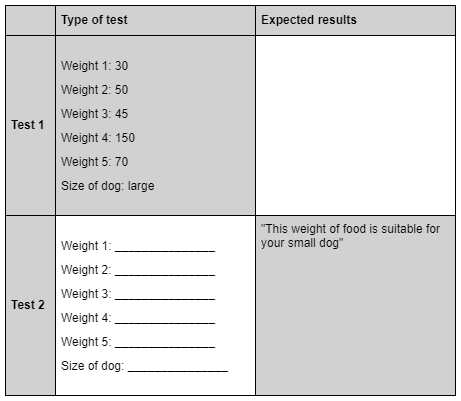

# N5 CS 2022 Task 1B

AutoFeed has designed an automatic dog food dispenser. The product is designed to help dog owners prevent overfeeding. The food dispenser has five containers. Each container holds a maximum of 200g of food. The containers release this food, one after another, at regular intervals throughout the day.  

AutoFeed wants an app to allow users to enter information about the size of their dog and the weight of food they will give them. The app uses this data to show if the weight of food is suitable for the size of dog.

AutoFeed research recommends the following total weight of food (per day), depending on the size of dog.

| Size of dog | Recommended total weight of food per day |
| ----------- | ---------------------------------------- |
| Small       | From 110g to 140g |
| Medium      | From 330g to 440g |
| Large       | From 690g to 900g |

After analysing the problem, the following inputs, processes and outputs have been identified. 

### Inputs

* the weight of food in each container
* the size of dog (small, medium or large)

### Processes

* calculate the total weight of food in the five containers
* store a message that states if the total weight of food is within the recommended range 
* calculate the average weight of food in the five containers
* round the average weight of food to one decimal place

### Outputs

* the weight of food in each container
* the average weight of food in the five containers
* the rounded average weight of food
* the stored message stating if the total weight of food is within the recommended range

### Assumptions

* the user can enter a weight using whole numbers or real numbers
* the user does not need to fill all five containers
* the user will not refill any of the containers until all containers are empty

## Program design (completed pseudocode)

### Main steps

```
1  Enter valid weight of food in each container and calculate total weight
2  Enter size of dog
3  Store a message that states if the total weight of food is within the recommended range for the size of dog entered
4  Calculate average weight of food
5  Display output messages
```

### Refinements
```
1.1	 totalWeight = 0
1.2	 start fixed loop 5 times
1.3	     enter the foodWeight
1.4	     while the foodWeight < 0 or foodWeight > 200 
1.5	         display “Invalid, a single container can only hold up to 200g”
1.6	         re-enter the foodWeight
1.7	     end while 
1.8	     totalWeight = totalWeight + foodWeight
1.9	 end fixed loop
```

```
2.1  display “Please enter the size of your dog: small, medium or large”
2.2	 enter size of dog
```

```
3.1  if dog size = small and totalWeight is from 110 to 140 then
3.2      store message “This weight of food is suitable for your small dog.”
3.3   else
3.4	     if dog size = medium and totalWeight is from 330 to 440 then
3.5         store message “This weight of food is suitable for your medium dog.”
3.6      else	
3.7	         if dog size = large and totalWeight is from 690 to 900 then 
3.8	             store message “This weight of food is suitable for your large dog.”
3.9          else
3.10            store message “This weight of food is not recommended for the size of your dog”
3.11	    end if
3.12     end if
3.13 end if
```

```
4.1 averageWeight = totalWeight / 5
4.2  round averageWeight to 1 decimal place
```

```
5.1  start fixed loop 5 times
5.2      display next foodWeight
5.3  end fixed loop
5.4  display total weight message
5.5  display average weight message
5.6  display stored recommendation message
```

__1b__ Using the program analysis and the design, implement the program in a language of your choice. 

Make sure the program matches the pseudocode provided.  (___15 marks___)

Print evidence of your program code.
                  
__1c (i)__ Run your program using the following test data to check that the message “This weight of food is suitable for your medium dog” is displayed: 
	
	Weight 1: 134.23
	Weight 2: 74.99
	Weight 3: 25.31
	Weight 4: 112.33
	Weight 5: 53.78
	Size of dog: medium

	Print evidence of the test run showing all inputs and the message displayed.  (___1 mark___)

__1c (ii)__	Additional test data is required to check that the correct output messages are displayed. 

Complete the test table below to show the expected results for Test 1 and appropriate inputs for Test 2.  (___2 marks___)


                  
__1d__	With reference to your code, evaluate your program by commenting on the following:

* Efficiency of your program code	(___2 marks___)
                  
* Robustness of your completed program (___1 mark___)

* Readability of your code (___1 mark___)