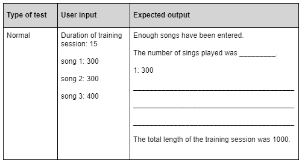

# N5 CS 2024 - Task 1 Part B


## Introduction

Delaney’s Disco wants to provide training sessions for their DJs. They want a computer program to be developed to ensure each training session runs smoothly.  


## Program analysis

The program will ask for the duration of a training session. The DJ enters the duration of each song they will play. The program will add up the duration of all songs until the total is greater than or equal to the duration of the training session. At this point, the program tells the DJ they have selected enough songs to complete the training session.

The program will select a random song when the DJ should switch on the foam machine.


### Assumptions

* The duration of the training session will be entered in minutes but stored as seconds. 
* The duration of the training session will between 10 and 30 minutes. 
* The duration of each song will be entered in seconds. 
* When the final song is played in full, the training session duration may be longer than the original session duration entered by the user. 


### Main steps

```
1  initialise variables 
2  get valid training session duration  
3  convert duration of training session to seconds 
4  calculate total duration of songs 
5  display training session summary
```

### Refinements

```
2.1  ask for duration of training session
2.2  while duration of training session < 10 or > 30
2.3      display error message to enter valid number
2.4      ask user to re-enter duration of training session
2.5  end while loop
```
 
```
3.1  duration of training session = duration of training session * 60 
```
 
```
4.1  songCounter = 0 
4.2  while total < duration of training session 
4.3      get and store duration of next song in seconds 
4.4      total = total + duration of next song 
4.5      if total >= duration of training session 
4.6          display message to inform user that they have entered enough songs 
4.7      end if 
4.8      add 1 to songCounter 
4.9  end while loop 
```
 
```
5.1  counter = 1 
5.2  display message stating the number of songs played + songCounter 
5.3  foamMachine = random number between 1 and songCounter 
5.4  start fixed loop for each stored song duration 
5.5      display counter + “:” + duration of next song 
5.6      if foamMachine = counter 
5.7          display message to start foam machine 
5.8      end if 
5.9      counter = counter + 1 
5.10 end fixed loop 
5.11 display total with message 
```

__1c__ Using the program design, complete the expected output in the test table below.

Assume the foam machine message is displayed at song 2.  (___2 marks___)



__1d__ Implement the program in a language of your choice.

Ensure the program matches the design given and remember to test your program.

Print evidence of your program code.  (___15 marks___)

__1e__ With reference to your code, evaluate your program by commenting on the following:

* Efficient use of programming constructs  (___2 marks___)
* Robustness of your completed program   (___1 marks___)
