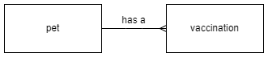

# N5 DDD GitHub Database

For use with DDD notes on [GitHub](https://mrfriendcs.github.io/N5-CS-DDD.html).

## ER Diagram

## Data Dictionary

### Table: pet

| Attribute | Key | Req'd | Type | Validation | Example |
| --- | :---: | :---: | --- | --- | --- |
| pet_id | PK | Y | number | range: >= 1 | 2 |
| name | | Y | text | | Minnie |
| species | | Y | text | | Gerbil |
| dob | | | text | length = 10 | 2021-05-24 |

### Table: vaccination

| Attribute | Key | Req'd | Type | Validation | Example
| --- | :---: | :---: | --- | --- | --- |
| vax_id | PK | Y | number | range: >= 1 | 2 |
| pet_id | FK | Y | number | Exists in pet table | 1 |
| vax_date | | Y | text | length = 10 | 2021-11-06 |
| name | | Y | text | | Distemper |
| reaction | | Y | number | restricted choice: 0, 1 | 0 |
| price | | Y | number | range: >= 10 and <= 100 | 27.99 |
