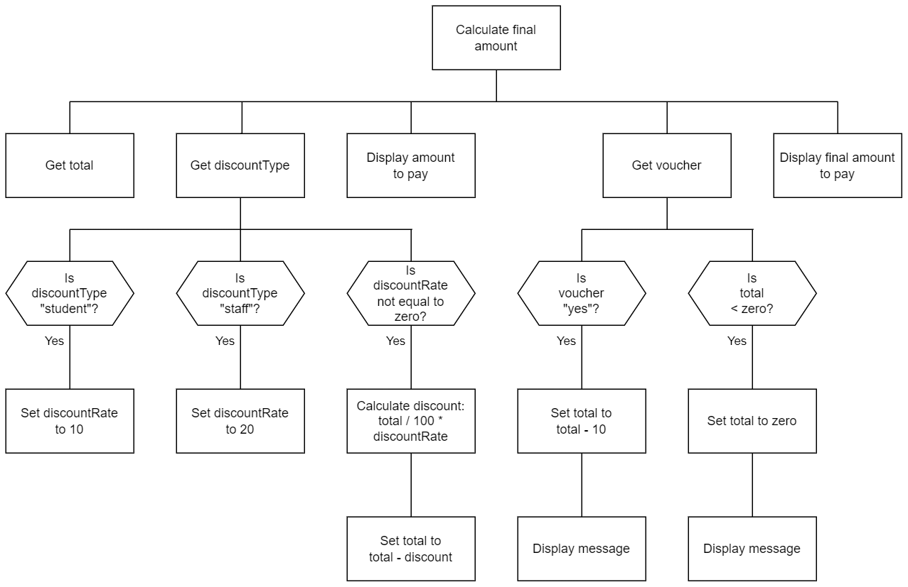

# N5 SDD - Decisions Decisions

## Introduction

The University of Barra (UoB) bookshop wants to update how it calculates the discount that students and staff get when they buy something.  A gift voucher can be used to pay for all or some of the purchase.  Only one £10 gift voucher can be used per purchase.  When using a voucher, no change is given if the amount to pay is less than £10.

Currently, the total is rung up using an old till with any discount or vouchers being calculated by hand.  There have been some embarrassing mistakes!  Hence the need to modernise.

## Task

Create a program that will accept a non-discounted amount, calculate the discounted price if appropriate, and then take into account using a voucher to pay for some, or all, of the amount.

A structure diagram of the design is provided below.

## Design (Structure Diagram)



## Assumptions

1. The initial amount will be entered as pounds:

* £10 as 10
* 50p as 0.50

2. Any text entered is lower case.

3. Any rounding of the final amount will be done by the UoB bookshop staff.

## Examples

Examples of the expected user interface are shown below with some possible input and output values.

### User Interface - Example 1
```
Total amount: £10

Discount? student

Amount to pay: £9

Voucher? yes
£10 voucher applied
No change given when using a voucher

Final amount to pay: £0
```

### User Interface - Example 2
```
Total amount: £7.25

Discount? no

Amount to pay: £7.25

Voucher? no

Final amount to pay: £7.25
```

### User Interface - Example 3
```
Total amount: £25.50

Discount: staff

Amount to pay: £20.40

Voucher? yes
£10 voucher applied

Final amount to pay: £10.40
```
